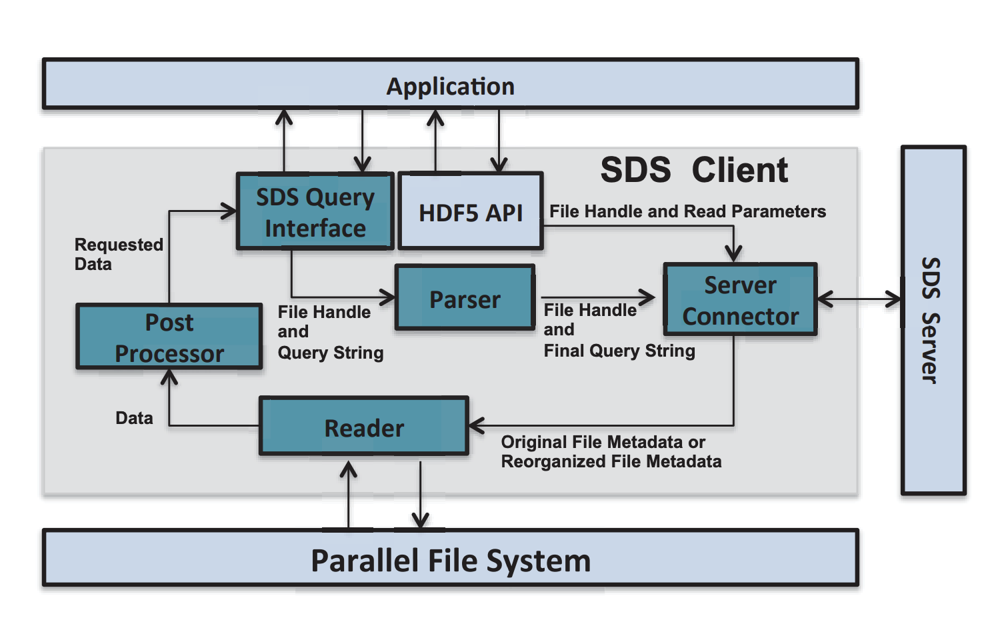

SDS (Scientific Data Services) framework.

Please report any problem you've encountered in using this package to Bin Dong at dbin@lbl.gov

For installation information, see INSTALL file. 
For the License, see below and Licence.txt file

***SDS Publications***
-----------------

1, Bin Dong, Suren Byna, and John Wu, 
   "SDS: A Framework for Scientific Data Services", 
   8th Parallel Data Storage Workshop (PDSW) held in conjunction with SC13, 2013

2, K. Wu, S. Byna, D. Rotem, and A. Shoshani, 
   "Scientific Data Services - A High-Performance I/O System with Array Semantics", 
   1st Workshop on High-Performance Computing meets Databases (HPCDB 2011), held in conjunction with SC11, 2011
 
3, Bin Dong, Suren Byna, and John Wu, 
   "Parallel Query Evaluation as a Scientific Data Service", 
   IEEE Cluster 2014

4, S. Blanas, K. Wu, S. Byna, B. Dong, and A. Shoshani, 
   "Parallel Data Analysis Directly on Scientific File Formats", 
   ACM SIGMOD 2014

5, J. Liu, S. Byna, B. Dong, K. Wu, and Y. Chen, 
    "Model-driven Data Layout Selection for Improving Read Performance", 
    High Performance Data Intensive Computing (HPDIC2014) workshop in conjunction with IEEE IPDPS 2014

***License Agreement***
"SDS - Scientific Data Services framework, Copyright (c) 2015, The Regents of the University of California, through Lawrence Berkeley National Laboratory (subject to receipt of any required approvals from the U.S. Dept. of Energy).  All rights reserved."
 
Redistribution and use in source and binary forms, with or without modification, are permitted provided that the following conditions are met:
 
(1) Redistributions of source code must retain the above copyright notice, this list of conditions and the following disclaimer.
 
(2) Redistributions in binary form must reproduce the above copyright notice, this list of conditions and the following disclaimer in the documentation and/or other materials provided with the distribution.
 
(3) Neither the name of the University of California, Lawrence Berkeley National Laboratory, U.S. Dept. of Energy nor the names of its contributors may be used to endorse or promote products derived from this software without specific prior written permission.
 
THIS SOFTWARE IS PROVIDED BY THE COPYRIGHT HOLDERS AND CONTRIBUTORS "AS IS" AND ANY EXPRESS OR IMPLIED WARRANTIES, INCLUDING, BUT NOT LIMITED TO, THE IMPLIED WARRANTIES OF MERCHANTABILITY AND FITNESS FOR A PARTICULAR PURPOSE ARE DISCLAIMED. IN NO EVENT SHALL THE COPYRIGHT OWNER OR CONTRIBUTORS BE LIABLE FOR ANY DIRECT, INDIRECT, INCIDENTAL, SPECIAL, EXEMPLARY, OR CONSEQUENTIAL DAMAGES (INCLUDING, BUT NOT LIMITED TO, PROCUREMENT OF SUBSTITUTE GOODS OR SERVICES; LOSS OF USE, DATA, OR PROFITS; OR BUSINESS INTERRUPTION) HOWEVER CAUSED AND ON ANY THEORY OF LIABILITY, WHETHER IN CONTRACT, STRICT LIABILITY, OR TORT (INCLUDING NEGLIGENCE OR OTHERWISE) ARISING IN ANY WAY OUT OF THE USE OF THIS SOFTWARE, EVEN IF ADVISED OF THE POSSIBILITY OF SUCH DAMAGE.
 
You are under no obligation whatsoever to provide any bug fixes, patches, or upgrades to the features, functionality or performance of the source code ("Enhancements") to anyone; however, if you choose to make your Enhancements available either publicly, or directly to Lawrence Berkeley National Laboratory, without imposing a separate written license agreement for such Enhancements, then you hereby grant the following license: a  non-exclusive, royalty-free perpetual license to install, use, modify, prepare derivative works, incorporate into other computer software, distribute, and sublicense such enhancements or derivative works thereof, in binary and source code form.

